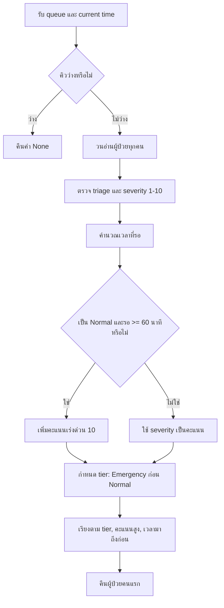
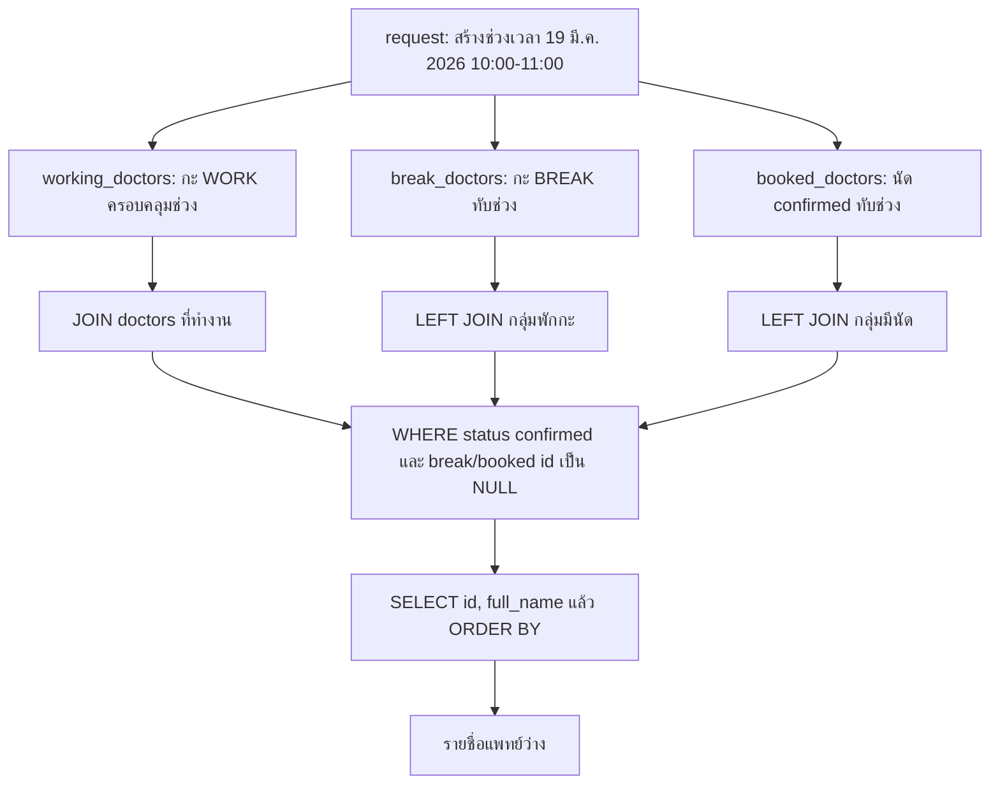
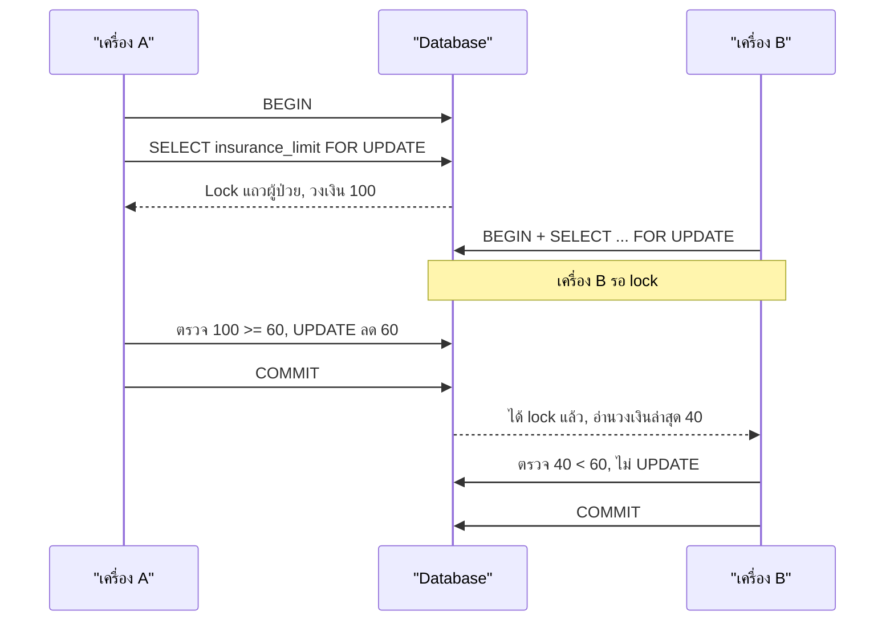

# คำตอบข้อสอบ Hospital System — AI-Ready

> คำตอบสำหรับแบบทดสอบ Fullstack Developer (Specialized: Hospital System)

Repository นี้เน้นการออกแบบระบบที่ปลอดภัย อธิบายเหตุผลได้ และนำไปพัฒนาต่อได้จริง มากกว่าการสร้างหน้าจอที่ยังทำไม่เสร็จ มีตัวอย่างโค้ดสำหรับระบบคิวและการตัดวงเงินประกัน, SQL สำหรับหาแพทย์ว่าง และเอกสารคำตอบครบทั้ง 7 ข้อ

## โจทย์ข้อสอบ

### ส่วนที่ 1 — Technical & High-Stakes Logic (40 คะแนน)

1. **The Intelligent Priority Queue (15 คะแนน)**
   - เขียน `getUrgentPatient(queue, currentTime)`
   - Emergency (E) ต้องมาก่อน Normal (N) เสมอ
   - ถ้าอยู่กลุ่มเดียวกัน ให้ผู้ที่มี Severity Score (1–10) สูงกว่าได้รับการรักษาก่อน
   - Normal ที่รอเกิน 60 นาที จะถูกขยับ Priority ขึ้นมาเทียบเท่า Emergency ชั่วคราว
   - วิเคราะห์ Time Complexity เมื่อคิวมี 10,000 คน

2. **Complex SQL — Doctor's Availability (10 คะแนน)**
   - หาแพทย์ว่างในวันที่ 19 มีนาคม 2026 เวลา 10:00–11:00
   - ต้องไม่มีนัดที่ `status = 'confirmed'` ในช่วงดังกล่าว
   - ต้องไม่อยู่ในช่วงพักกะจากตาราง `doctor_shifts`
   - ต้องรองรับนัดก่อนหน้าที่เวลาล้นมาทับช่วง 10:00

3. **Code Review — The Race Condition (15 คะแนน)**
   - แก้โค้ดตัดวงเงินประกัน เมื่อมีการเบิกจาก 2 เครื่องพร้อมกัน
   - ระบุปัญหา SQL Injection และ Race Condition
   - เขียนใหม่ด้วย Database Transaction และ Row-level Locking (`SELECT FOR UPDATE`)

### ส่วนที่ 2 — Business Architecture & Safety (30 คะแนน)

4. **Drug Allergy & Safety Design (15 คะแนน)**
   - ออกแบบตาราง `drug_allergies` และ `prescriptions`
   - ระบุ Database Constraint ที่ป้องกันใบสั่งยาสำหรับยาที่ผู้ป่วยแพ้
   - อธิบาย Alert และผู้มีสิทธิ์ Override

5. **System Scalability — Lab Results (15 คะแนน)**
   - ออกแบบการจัดเก็บภาพ X-Ray ความละเอียดสูง และการส่งผล Lab ให้ลื่นบนมือถือ เช่น compression หรือ CDN ภายใน
   - อธิบายมาตรการ PDPA เพื่อไม่ให้ผล Lab รั่วไหลออกนอกองค์กร

### ส่วนที่ 3 — AI Integrity (30 คะแนน)

6. **Symptom to Structured Data (10 คะแนน)**
   - เขียน Prompt เพื่อแปลงข้อความเป็น JSON: _“ปวดท้องบิดๆ มา 2 ชั่วโมง กินส้มตำปูปลาร้ามา”_
   - ป้องกัน AI วินิจฉัยโรคเอง (Hallucination) และบังคับให้ตอบเฉพาะข้อมูลที่ผู้ป่วยให้มา

7. **Smart Drug Interaction Checker (20 คะแนน)**
   - วาด Diagram การเชื่อมต่อระหว่างฐานข้อมูลยากับ AI Model
   - ออกแบบ Human-in-the-loop เมื่อ AI ให้คำแนะนำที่ไม่มั่นใจ

## คำตอบข้อ 1 — The Intelligent Priority Queue

### 1) แนวคิดที่ใช้แก้ปัญหา

แนวทางนี้แบ่งผู้ป่วยเป็น 2 ระดับ (tier) ก่อนเสมอ: `EMERGENCY` และ `NORMAL` เพื่อให้ Emergency มาก่อน Normal อย่างเด็ดขาด จากนั้นจึงเปรียบเทียบ **Severity Score** ภายในระดับเดียวกัน

สำหรับ Normal ที่รออย่างน้อย 60 นาที ระบบให้คะแนนเร่งด่วนเพิ่ม 10 คะแนน เพื่อไม่ให้ผู้ป่วยที่รอนานถูกแซงด้วย Normal ที่เพิ่งมาถึงตลอดเวลา กรณีคะแนนเท่ากัน ใช้เวลามาถึงก่อนเป็นตัวตัดสิน เพื่อให้ยุติธรรมและอธิบายได้

> **Assumption ที่ใช้ตอบ:** ข้อความ “Emergency ต้องมาก่อน Normal เสมอ” เป็นกติกาสูงสุด ดังนั้น Normal ที่รอนานจะถูกยกระดับเหนือ Normal คนอื่น แต่ไม่แซง Emergency จริง

### 2) โค้ดที่ใช้ตอบข้อสอบ

ไฟล์เต็มอยู่ที่ [`src/priority_queue.py`](src/priority_queue.py) โดยจุดสำคัญคือฟังก์ชันที่โจทย์ระบุ:

```python
def get_urgent_patient(queue, current_time=None):
    """คืนผู้ป่วยที่ควรได้รับการรักษาคนถัดไป หรือ None หากคิวว่าง"""
    ordered_queue = order_patients(queue, current_time)
    return ordered_queue[0] if ordered_queue else None
```

ฟังก์ชันนี้เรียก `order_patients()` เพื่อสร้าง priority ของผู้ป่วยทุกคน แล้วคืนคนแรกของคิวที่เรียงแล้ว ส่วน logic หลักในการคำนวณคะแนนเป็นดังนี้:

```python
waited_minutes = max(0, int((now - patient["arrived_at"]).total_seconds() // 60))
escalation_boost = 10 if patient["triage"] == "NORMAL" and waited_minutes >= 60 else 0
priority_score = patient["severity"] + escalation_boost
```

### 3) Algorithm ทำงานอย่างไร



**ตัวอย่างการจัดลำดับ**

| ผู้ป่วย | Triage | Severity | เวลาที่รอ | คะแนนหลังคำนวณ | ผลลัพธ์ |
|---|---:|---:|---:|---:|---|
| E-01 | Emergency | 3 | 5 นาที | 3 | มาก่อนเสมอ เพราะเป็น Emergency |
| N-01 | Normal | 10 | 20 นาที | 10 | รอหลัง E-01 |
| N-02 | Normal | 2 | 75 นาที | 12 | มาก่อน N-01 เพราะได้ wait-time boost |
| N-03 | Normal | 5 | 10 นาที | 5 | รอหลัง N-01 |

ดังนั้นลำดับคือ **E-01 → N-02 → N-01 → N-03** ค่ะ

### 4) Time Complexity เมื่อมี 10,000 คน

โค้ดตัวอย่างใช้การสร้างคะแนนให้ผู้ป่วยทุกคน 1 รอบ และเรียงทั้งคิว:

| ขั้นตอน | Complexity | เมื่อมี 10,000 คน |
|---|---:|---|
| คำนวณคะแนนและตรวจข้อมูล | `O(n)` | อ่านผู้ป่วย 10,000 คน 1 รอบ |
| เรียงคิว | `O(n log n)` | ประมาณ 10,000 × log₂(10,000) หรือราว 133,000 หน่วยการเปรียบเทียบ |
| หน่วยความจำ | `O(n)` | เก็บข้อมูลที่คำนวณแล้วของผู้ป่วย 10,000 คน |

**สรุป:** `O(n log n)` สำหรับ 10,000 คนยังทำงานได้รวดเร็วมากในระบบเว็บทั่วไป และมีข้อดีคือแสดงคิวทั้งหมดบนหน้าจอ triage ได้ทันที หากต้องการเพียง “ผู้ป่วยคนถัดไป” ในระบบขนาดใหญ่ขึ้น สามารถปรับเป็นการวนหาอันดับสูงสุดเพียงรอบเดียว (`O(n)`) หรือใช้ priority queue/heap เพื่อให้การเพิ่มและดึงคิวเร็วขึ้นได้

## คำตอบข้อ 2 — Complex SQL: Doctor's Availability

### 1) สมมติฐานของตาราง

- `doctors(id, full_name, status)` — ใช้ `status = 'confirmed'` สำหรับแพทย์ที่พร้อมรับนัด
- `doctor_shifts(doctor_id, starts_at, ends_at, shift_type)` — `shift_type` เป็น `WORK` หรือ `BREAK`
- `appointments(doctor_id, starts_at, ends_at, status)` — ใช้ `status = 'confirmed'` สำหรับนัดที่มีผลจริง
- เวลาเก็บเป็น `timestamptz`; ช่วงเวลานัดใช้รูปแบบ `[starts_at, ends_at)` เพื่อให้นัดที่จบ 10:00 และนัดใหม่เริ่ม 10:00 อยู่ต่อกันได้โดยไม่ชนกัน

### 2) SQL ค้นหารายชื่อแพทย์ว่าง

```sql
-- PostgreSQL: ค้นหาแพทย์ว่างวันที่ 19 มีนาคม 2026 เวลา 10:00–11:00
WITH request AS (
  SELECT
    (DATE '2026-03-19' + TIME '10:00') AT TIME ZONE 'Asia/Bangkok' AS starts_at,
    (DATE '2026-03-19' + TIME '11:00') AT TIME ZONE 'Asia/Bangkok' AS ends_at
),
working_doctors AS (
  SELECT DISTINCT s.doctor_id
  FROM doctor_shifts s CROSS JOIN request r
  WHERE s.shift_type = 'WORK'
    AND s.starts_at <= r.starts_at AND s.ends_at >= r.ends_at
),
break_doctors AS (
  SELECT DISTINCT s.doctor_id
  FROM doctor_shifts s CROSS JOIN request r
  WHERE s.shift_type = 'BREAK'
    AND s.starts_at < r.ends_at AND s.ends_at > r.starts_at
),
booked_doctors AS (
  SELECT DISTINCT a.doctor_id
  FROM appointments a CROSS JOIN request r
  WHERE a.status = 'confirmed'
    AND a.starts_at < r.ends_at AND a.ends_at > r.starts_at
)
SELECT d.id, d.full_name
FROM doctors d
JOIN working_doctors w ON w.doctor_id = d.id
LEFT JOIN break_doctors b ON b.doctor_id = d.id
LEFT JOIN booked_doctors a ON a.doctor_id = d.id
WHERE d.status = 'confirmed'
  AND b.doctor_id IS NULL
  AND a.doctor_id IS NULL
ORDER BY d.full_name;
```

CTE ทำให้แต่ละกลุ่มมีชื่อที่สื่อความหมาย และ query สุดท้ายอ่านได้ว่า “เลือกแพทย์ที่ทำงาน แล้วตัดคนที่พักกะหรือมีนัดออก” โดย PostgreSQL optimizer ยังสามารถเลือก execution plan ที่มีประสิทธิภาพได้

SQL ไฟล์แยกอยู่ที่ [`sql/doctor-availability.sql`](sql/doctor-availability.sql) เพื่อใช้กับ database ได้โดยตรง

### 3) เงื่อนไข Overlap ที่สำคัญ

```sql
existing.starts_at < request.ends_at
AND existing.ends_at > request.starts_at
```

ตัวอย่างนัดเดิม **09:30–10:30** และช่วงที่ค้นหา **10:00–11:00**:

- `09:30 < 11:00` เป็นจริง
- `10:30 > 10:00` เป็นจริง

เมื่อทั้งสองเงื่อนไขเป็นจริง แปลว่าช่วงเวลาทับกัน จึงไม่แสดงแพทย์คนนั้น ผลลัพธ์นี้ครอบคลุมกรณีนัดเริ่มก่อน 10:00 แล้วล้นเข้ามาในช่วงที่ค้นหาด้วย

### 4) SQL Logical Order

> ลำดับนี้คือ **logical order เพื่ออธิบายความหมายของ SQL**; database optimizer อาจเลือกแผนรันจริงต่างออกไปเพื่อประสิทธิภาพ



ลำดับที่ใช้เล่า SQL คือ:

1. `request` สร้างเวลาเริ่มและเวลาจบเพียงครั้งเดียว เพื่อไม่ hard-code เวลาซ้ำหลายจุด
2. `working_doctors` เก็บเฉพาะแพทย์ที่มี `WORK` shift ครอบคลุม 10:00–11:00
3. `break_doctors` เก็บแพทย์ที่มี `BREAK` shift ทับช่วงเวลา เพื่อนำไปตัดออกภายหลัง
4. `booked_doctors` เก็บแพทย์ที่มีนัด `confirmed` ทับช่วงเวลา รวมถึงนัดที่เริ่มก่อน 10:00
5. query สุดท้าย `JOIN` กับ `working_doctors` จึงเหลือเฉพาะแพทย์ที่ทำงาน
6. `LEFT JOIN` กับ `break_doctors` และ `booked_doctors` เพื่อระบุกลุ่มที่ต้องตัดออก
7. `WHERE b.doctor_id IS NULL AND a.doctor_id IS NULL` เก็บเฉพาะคนที่ไม่พักกะและไม่มีนัดชนกัน
8. `SELECT` เลือก `id`, `full_name` แล้ว `ORDER BY` เรียงชื่อเพื่อให้ผลลัพธ์อ่านง่ายและคงที่

### 5) ประสิทธิภาพและข้อควรเพิ่มใน production

ควรสร้าง index ที่ `appointments(doctor_id, starts_at, ends_at)` สำหรับนัด `confirmed` และ `doctor_shifts(doctor_id, starts_at, ends_at)` เพื่อให้ CTE และ joins ไม่ต้อง scan ทั้งตารางทุกครั้ง เมื่อระบบมีการจองนัดพร้อมกันจริง ควรเพิ่ม transaction และ exclusion constraint ของ PostgreSQL เพื่อกันสอง request จอง slot เดียวกันพร้อมกัน

## คำตอบข้อ 3 — Code Review: Race Condition และ SQL Injection

### 1) ปัญหาในโค้ดเดิม

| ปัญหา | เกิดขึ้นอย่างไร | ผลกระทบ |
|---|---|---|
| SQL Injection | นำ `patientId` และ `treatmentCost` มาต่อเป็น SQL string โดยตรง | ผู้โจมตีอาจเปลี่ยนเงื่อนไข SQL หรืออ่าน/แก้ข้อมูลที่ไม่ควรเข้าถึง |
| Race Condition | สอง request อ่านวงเงินเดียวกันก่อนที่ request ใดจะ update | ระบบอนุมัติการเบิกเกินวงเงินจริง หรือเกิด lost update |

**ตัวอย่าง Race Condition:** วงเงินเริ่มต้น 100 บาท, เครื่อง A และ B ขอเบิกเครื่องละ 60 บาทพร้อมกัน ทั้งสองเครื่องอ่านค่า 100 และผ่านเงื่อนไข จากนั้นทั้งคู่ update เหลือ 40 บาท ผลคืออนุมัติรวม 120 บาท ทั้งที่วงเงินมีเพียง 100 บาท

### 2) แนวทางแก้ไข

ใช้ database transaction เพื่อให้ขั้นตอนอ่าน-ตรวจ-ตัดวงเงินเป็นงานเดียวกัน และใช้ `SELECT ... FOR UPDATE` เพื่อ lock แถวผู้ป่วยคนนั้นจนกว่า transaction จะ `COMMIT` หรือ `ROLLBACK` request ที่สองของผู้ป่วยคนเดิมจึงต้องรอและจะอ่านวงเงินล่าสุดหลัง request แรกเสร็จ

```python
LOCK_PATIENT_SQL = """
SELECT insurance_limit
FROM patients
WHERE id = %s
FOR UPDATE;
"""

CLAIM_SQL = """
UPDATE patients
SET insurance_limit = insurance_limit - %s
WHERE id = %s;
"""

def claim_insurance(connection, patient_id, treatment_cost):
    build_claim_params(patient_id, treatment_cost)

    with connection.transaction():
        patient = connection.fetch_one(LOCK_PATIENT_SQL, (patient_id,))

        if patient is None or patient["insurance_limit"] < treatment_cost:
            return False

        connection.execute(CLAIM_SQL, (treatment_cost, patient_id))
        return True
```

> `build_claim_params()` ตรวจว่า `patient_id` และ `treatment_cost` เป็นจำนวนเต็มบวกก่อนเริ่ม transaction

### 3) Transaction และ row lock ทำงานอย่างไร



เมื่อเครื่อง A commit แล้ว เครื่อง B จะเห็นวงเงินใหม่ 40 บาท จึงปฏิเสธการเบิก 60 บาท ไม่เกิดการใช้วงเงินเกิน

### 4) ป้องกัน SQL Injection

ค่าที่รับจากผู้ใช้ไม่ถูกต่อเข้า SQL string แต่ส่งเป็น parameter แยกต่างหาก:

```python
connection.fetch_one(LOCK_PATIENT_SQL, (patient_id,))
connection.execute(CLAIM_SQL, (treatment_cost, patient_id))
```

DB driver จะ bind ค่า parameter ให้ จึงไม่ตีความค่าอย่าง `"1 OR 1=1"` เป็นคำสั่ง SQL เพิ่มเติม อีกทั้ง validation บังคับให้ `patient_id` และ `treatment_cost` เป็นจำนวนเต็มบวกก่อนเริ่ม transaction

### 5) ข้อควรเพิ่มใน production

- ใช้ idempotency key เช่น `(patient_id, external_request_id)` เพื่อกันการกดซ้ำหรือ retry ซ้ำตัดวงเงินสองครั้ง
- บันทึก audit log ของ claim โดยเก็บ request ID, ผลลัพธ์ และเวลา แต่ไม่บันทึกข้อมูลสุขภาพเกินจำเป็น
- หาก transaction ผิดพลาดต้อง rollback ทั้งการตัดวงเงินและการสร้าง claim record พร้อมกัน

ตัวอย่างโค้ดและ unit test อยู่ที่ [`src/claim_insurance.py`](src/claim_insurance.py) และ [`tests/test_claim_insurance.py`](tests/test_claim_insurance.py)

## แผนที่คำตอบใน Repository

| ข้อ | ไฟล์คำตอบ |
|---|---|
| 1. Intelligent Priority Queue | `src/priority_queue.py`, `tests/test_priority_queue.py` — ฟังก์ชัน `get_urgent_patient` |
| 2. Doctor availability SQL | `sql/doctor-availability.sql` |
| 3. Race condition / SQL injection | `src/claim_insurance.py`, `docs/01-03-technical.md` |
| 4–5. Drug safety และ Lab scalability | `docs/04-05-business-safety.md` |
| 6–7. AI integrity | `docs/06-07-ai-integrity.md` |

## วิธีรันตัวอย่างโค้ด

```powershell
python -m unittest discover -s tests -v
```

ชุดทดสอบใช้ Python standard library จึงไม่ต้องติดตั้ง dependency เพิ่ม ครอบคลุมการจัดลำดับ Emergency, การยกระดับผู้ป่วยที่รอนาน, การตรวจ input และการป้องกันค่า ID ที่มีลักษณะเป็น SQL Injection

## สมมติฐานสำคัญในการออกแบบ

- เวลาในฐานข้อมูลเก็บเป็น `timestamptz` แบบ UTC และแสดงผลเป็นเขตเวลา `Asia/Bangkok`
- ช่วงเวลานัดหมายใช้รูปแบบ `[starts_at, ends_at)` จึงอนุญาตให้นัดหนึ่งจบพอดีกับอีกนัดเริ่มได้
- AI ไม่มีสิทธิ์ตัดสินใจทางคลินิกขั้นสุดท้าย ทำหน้าที่ได้เฉพาะสกัดข้อมูล ค้นหลักฐาน และอธิบายผล; บุคลากรที่มีคุณสมบัติต้องเป็นผู้อนุมัติ
- Normal ที่รอเกิน 60 นาทีถูกยกระดับเหนือ Normal ที่เพิ่งมา แต่ไม่แซง Emergency

## การใช้ AI และความรับผิดชอบของมนุษย์

AI ถูกใช้เป็นเครื่องมือช่วยร่างและตรวจทานเท่านั้น คำตอบสุดท้ายกำหนด assumption ชัดเจน ใช้กฎที่คาดเดาได้กับส่วนที่มีความเสี่ยงสูง, parameterized SQL, schema validation, audit trail และ human approval gate ซึ่งสำคัญกว่าการเพิ่ม LLM เข้าระบบเพียงอย่างเดียว
