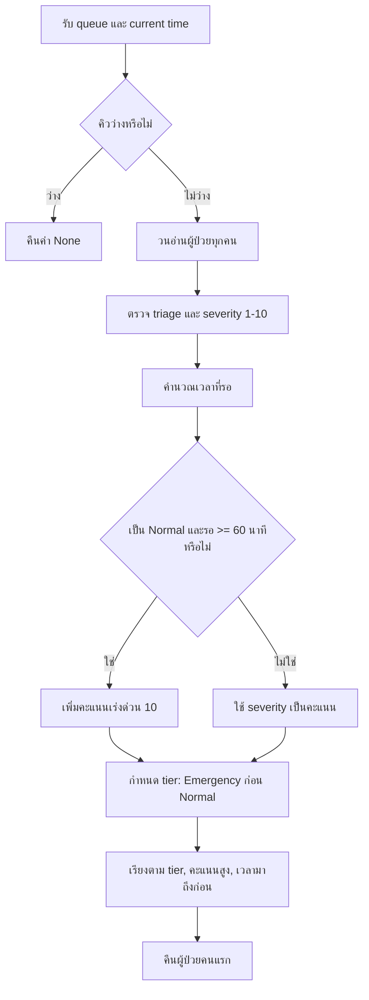

# คำตอบข้อสอบ Hospital System — AI-Ready

> คำตอบสำหรับแบบทดสอบ Fullstack Developer (Specialized: Hospital System)

Repository นี้เน้นการออกแบบระบบที่ปลอดภัย อธิบายเหตุผลได้ และนำไปพัฒนาต่อได้จริง มากกว่าการสร้างหน้าจอที่ยังทำไม่เสร็จ มีตัวอย่างโค้ดสำหรับระบบคิวและการตัดวงเงินประกัน, SQL สำหรับหาแพทย์ว่าง และเอกสารคำตอบครบทั้ง 7 ข้อ

## โจทย์ข้อสอบ

### ส่วนที่ 1 — Technical & High-Stakes Logic (40 คะแนน)

1. **The Intelligent Priority Queue (15 คะแนน)**
   - เขียน `getUrgentPatient(queue, currentTime)`
   - Emergency (E) ต้องมาก่อน Normal (N) เสมอ
   - ถ้าอยู่กลุ่มเดียวกัน ให้ผู้ที่มี Severity Score (1–10) สูงกว่าได้รับการรักษาก่อน
   - Normal ที่รอเกิน 60 นาที จะถูกขยับ Priority ขึ้นมาเทียบเท่า Emergency ชั่วคราว
   - วิเคราะห์ Time Complexity เมื่อคิวมี 10,000 คน

2. **Complex SQL — Doctor's Availability (10 คะแนน)**
   - หาแพทย์ว่างในวันที่ 19 มีนาคม 2026 เวลา 10:00–11:00
   - ต้องไม่มีนัดที่ `status = 'confirmed'` ในช่วงดังกล่าว
   - ต้องไม่อยู่ในช่วงพักกะจากตาราง `doctor_shifts`
   - ต้องรองรับนัดก่อนหน้าที่เวลาล้นมาทับช่วง 10:00

3. **Code Review — The Race Condition (15 คะแนน)**
   - แก้โค้ดตัดวงเงินประกัน เมื่อมีการเบิกจาก 2 เครื่องพร้อมกัน
   - ระบุปัญหา SQL Injection และ Race Condition
   - เขียนใหม่ด้วย Database Transaction และ Row-level Locking (`SELECT FOR UPDATE`)

### ส่วนที่ 2 — Business Architecture & Safety (30 คะแนน)

4. **Drug Allergy & Safety Design (15 คะแนน)**
   - ออกแบบตาราง `drug_allergies` และ `prescriptions`
   - ระบุ Database Constraint ที่ป้องกันใบสั่งยาสำหรับยาที่ผู้ป่วยแพ้
   - อธิบาย Alert และผู้มีสิทธิ์ Override

5. **System Scalability — Lab Results (15 คะแนน)**
   - ออกแบบการจัดเก็บภาพ X-Ray ความละเอียดสูง และการส่งผล Lab ให้ลื่นบนมือถือ เช่น compression หรือ CDN ภายใน
   - อธิบายมาตรการ PDPA เพื่อไม่ให้ผล Lab รั่วไหลออกนอกองค์กร

### ส่วนที่ 3 — AI Integrity (30 คะแนน)

6. **Symptom to Structured Data (10 คะแนน)**
   - เขียน Prompt เพื่อแปลงข้อความเป็น JSON: _“ปวดท้องบิดๆ มา 2 ชั่วโมง กินส้มตำปูปลาร้ามา”_
   - ป้องกัน AI วินิจฉัยโรคเอง (Hallucination) และบังคับให้ตอบเฉพาะข้อมูลที่ผู้ป่วยให้มา

7. **Smart Drug Interaction Checker (20 คะแนน)**
   - วาด Diagram การเชื่อมต่อระหว่างฐานข้อมูลยากับ AI Model
   - ออกแบบ Human-in-the-loop เมื่อ AI ให้คำแนะนำที่ไม่มั่นใจ

## คำตอบข้อ 1 — The Intelligent Priority Queue

### 1) แนวคิดที่ใช้แก้ปัญหา

แนวทางนี้แบ่งผู้ป่วยเป็น 2 ระดับ (tier) ก่อนเสมอ: `EMERGENCY` และ `NORMAL` เพื่อให้ Emergency มาก่อน Normal อย่างเด็ดขาด จากนั้นจึงเปรียบเทียบ **Severity Score** ภายในระดับเดียวกัน

สำหรับ Normal ที่รออย่างน้อย 60 นาที ระบบให้คะแนนเร่งด่วนเพิ่ม 10 คะแนน เพื่อไม่ให้ผู้ป่วยที่รอนานถูกแซงด้วย Normal ที่เพิ่งมาถึงตลอดเวลา กรณีคะแนนเท่ากัน ใช้เวลามาถึงก่อนเป็นตัวตัดสิน เพื่อให้ยุติธรรมและอธิบายได้

> **Assumption ที่ใช้ตอบ:** ข้อความ “Emergency ต้องมาก่อน Normal เสมอ” เป็นกติกาสูงสุด ดังนั้น Normal ที่รอนานจะถูกยกระดับเหนือ Normal คนอื่น แต่ไม่แซง Emergency จริง

### 2) โค้ดที่อธิบายในวิดีโอ

ไฟล์เต็มอยู่ที่ [`src/priority_queue.py`](src/priority_queue.py) โดยจุดสำคัญคือฟังก์ชันที่โจทย์ระบุ:

```python
def get_urgent_patient(queue, current_time=None):
    """คืนผู้ป่วยที่ควรได้รับการรักษาคนถัดไป หรือ None หากคิวว่าง"""
    ordered_queue = order_patients(queue, current_time)
    return ordered_queue[0] if ordered_queue else None
```

ฟังก์ชันนี้เรียก `order_patients()` เพื่อสร้าง priority ของผู้ป่วยทุกคน แล้วคืนคนแรกของคิวที่เรียงแล้ว ส่วน logic หลักในการคำนวณคะแนนเป็นดังนี้:

```python
waited_minutes = max(0, int((now - patient["arrived_at"]).total_seconds() // 60))
escalation_boost = 10 if patient["triage"] == "NORMAL" and waited_minutes >= 60 else 0
priority_score = patient["severity"] + escalation_boost
```

### 3) Algorithm ทำงานอย่างไร



**ตัวอย่างการจัดลำดับ**

| ผู้ป่วย | Triage | Severity | เวลาที่รอ | คะแนนหลังคำนวณ | ผลลัพธ์ |
|---|---:|---:|---:|---:|---|
| E-01 | Emergency | 3 | 5 นาที | 3 | มาก่อนเสมอ เพราะเป็น Emergency |
| N-01 | Normal | 10 | 20 นาที | 10 | รอหลัง E-01 |
| N-02 | Normal | 2 | 75 นาที | 12 | มาก่อน N-01 เพราะได้ wait-time boost |
| N-03 | Normal | 5 | 10 นาที | 5 | รอหลัง N-01 |

ดังนั้นลำดับคือ **E-01 → N-02 → N-01 → N-03** ค่ะ

### 4) Time Complexity เมื่อมี 10,000 คน

โค้ดตัวอย่างใช้การสร้างคะแนนให้ผู้ป่วยทุกคน 1 รอบ และเรียงทั้งคิว:

| ขั้นตอน | Complexity | เมื่อมี 10,000 คน |
|---|---:|---|
| คำนวณคะแนนและตรวจข้อมูล | `O(n)` | อ่านผู้ป่วย 10,000 คน 1 รอบ |
| เรียงคิว | `O(n log n)` | ประมาณ 10,000 × log₂(10,000) หรือราว 133,000 หน่วยการเปรียบเทียบ |
| หน่วยความจำ | `O(n)` | เก็บข้อมูลที่คำนวณแล้วของผู้ป่วย 10,000 คน |

**สรุปสำหรับพูดในวิดีโอ:** `O(n log n)` สำหรับ 10,000 คนยังทำงานได้รวดเร็วมากในระบบเว็บทั่วไป และมีข้อดีคือแสดงคิวทั้งหมดบนหน้าจอ triage ได้ทันที หากต้องการเพียง “ผู้ป่วยคนถัดไป” ในระบบขนาดใหญ่ขึ้น สามารถปรับเป็นการวนหาอันดับสูงสุดเพียงรอบเดียว (`O(n)`) หรือใช้ priority queue/heap เพื่อให้การเพิ่มและดึงคิวเร็วขึ้นได้

### 5) สคริปต์พูดสั้น ๆ

> “ข้อแรก ผมออกแบบให้ Emergency เป็น tier ที่สูงกว่า Normal เสมอครับ จากนั้นจึงใช้ Severity Score เรียงลำดับภายใน tier เดียวกัน สำหรับ Normal ที่รอเกิน 60 นาที ผมเพิ่มคะแนนเร่งด่วนเพื่อป้องกัน starvation แต่ยังไม่ให้แซง Emergency จริง เพื่อรักษากติกาหลักของโจทย์ครับ โค้ดตรวจผู้ป่วยทุกคน คำนวณเวลารอและคะแนน แล้วเรียงตาม tier, คะแนน และเวลามาถึง สำหรับ 10,000 คน complexity คือ O(n log n) ซึ่งเพียงพอสำหรับการ refresh คิว และหากระบบต้องการดึงเฉพาะคนถัดไปในอนาคต ผมสามารถใช้ heap หรือ one-pass scan เพื่อ optimize ต่อได้ครับ”

## แผนที่คำตอบใน Repository

| ข้อ | ไฟล์คำตอบ |
|---|---|
| 1. Intelligent Priority Queue | `src/priority_queue.py`, `tests/test_priority_queue.py` — ฟังก์ชัน `get_urgent_patient` |
| 2. Doctor availability SQL | `sql/doctor-availability.sql` |
| 3. Race condition / SQL injection | `src/claim_insurance.py`, `docs/01-03-technical.md` |
| 4–5. Drug safety และ Lab scalability | `docs/04-05-business-safety.md` |
| 6–7. AI integrity | `docs/06-07-ai-integrity.md` |

## วิธีรันตัวอย่างโค้ด

```powershell
python -m unittest discover -s tests -v
```

ชุดทดสอบใช้ Python standard library จึงไม่ต้องติดตั้ง dependency เพิ่ม ครอบคลุมการจัดลำดับ Emergency, การยกระดับผู้ป่วยที่รอนาน, การตรวจ input และการป้องกันค่า ID ที่มีลักษณะเป็น SQL Injection

## สมมติฐานสำคัญในการออกแบบ

- เวลาในฐานข้อมูลเก็บเป็น `timestamptz` แบบ UTC และแสดงผลเป็นเขตเวลา `Asia/Bangkok`
- ช่วงเวลานัดหมายใช้รูปแบบ `[starts_at, ends_at)` จึงอนุญาตให้นัดหนึ่งจบพอดีกับอีกนัดเริ่มได้
- AI ไม่มีสิทธิ์ตัดสินใจทางคลินิกขั้นสุดท้าย ทำหน้าที่ได้เฉพาะสกัดข้อมูล ค้นหลักฐาน และอธิบายผล; บุคลากรที่มีคุณสมบัติต้องเป็นผู้อนุมัติ
- Normal ที่รอเกิน 60 นาทีถูกยกระดับเหนือ Normal ที่เพิ่งมา แต่ไม่แซง Emergency

## การใช้ AI และความรับผิดชอบของมนุษย์

AI ถูกใช้เป็นเครื่องมือช่วยร่างและตรวจทานเท่านั้น คำตอบสุดท้ายกำหนด assumption ชัดเจน ใช้กฎที่คาดเดาได้กับส่วนที่มีความเสี่ยงสูง, parameterized SQL, schema validation, audit trail และ human approval gate ซึ่งสำคัญกว่าการเพิ่ม LLM เข้าระบบเพียงอย่างเดียว
