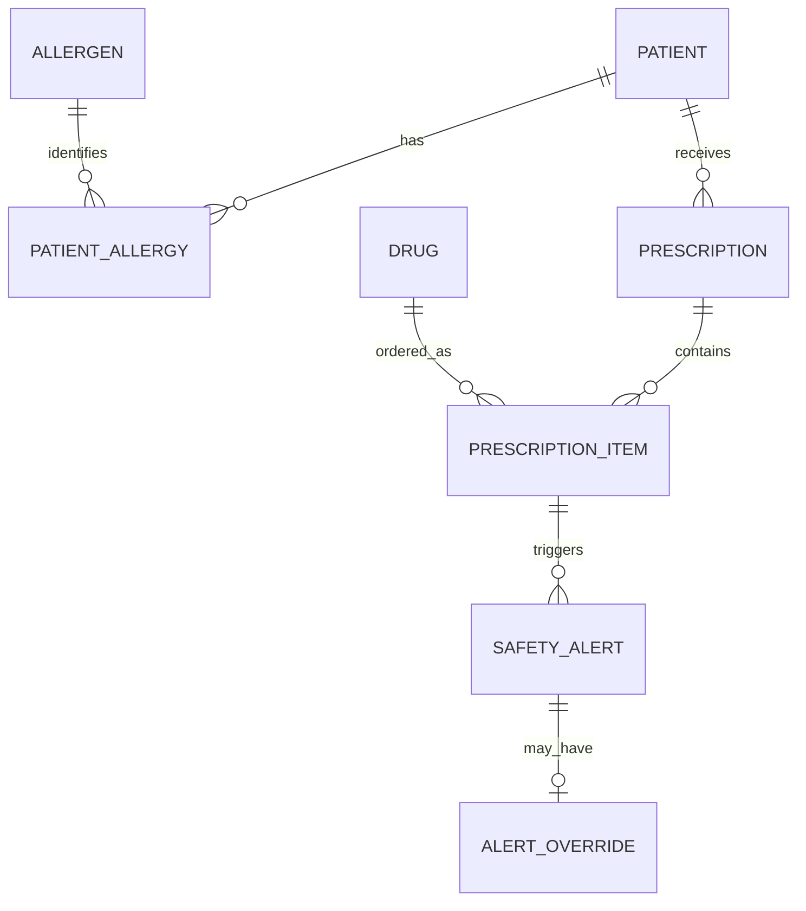
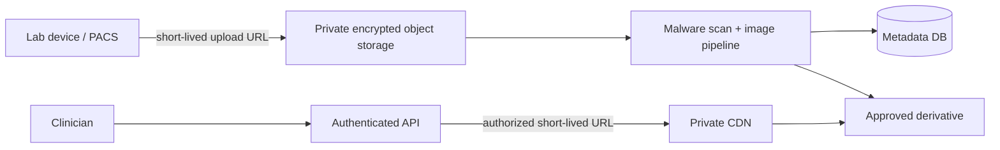

# Questions 4–5 — Business Architecture & Safety

## 4. Drug Allergy & Safety Design

### Data model and constraints

- `patient_allergy(patient_id, allergen_id, reaction, severity, recorded_by, recorded_at, status)` has `UNIQUE(patient_id, allergen_id)` for active records and FKs to patient/allergen.
- `drug_ingredient(drug_id, ingredient_id)` allows cross-checking both brand and generic drug components against allergens.
- `prescription_item` references a valid `prescription` and `drug`; status changes are append-only events rather than silent overwrites.
- A database transaction inserts the order and generates the alert from the same ingredient snapshot, preventing a partial order without its check.

### Workflow and override

1. Prescriber selects drug and dose; server performs deterministic allergy/ingredient matching.
2. A match creates an immutable `safety_alert` with severity and evidence. Severe matches block signing by default.
3. UI displays the allergen, reaction, source record, and recommended safe action—never a vague “warning”.
4. A clinician override requires role authorization, free-text clinical reason, second confirmation for severe reactions, timestamp, and audit event. It is not a button that silently dismisses the warning.
5. Pharmacy verifies before dispensing; safety team reviews override metrics for unsafe patterns.

## 5. System scalability — Lab images

### Storage and delivery

Upload directly from the Lab system via short-lived pre-signed URLs to object storage (for example S3/GCS/Azure Blob), not through the application server. Store the original as immutable encrypted object; generate lossless diagnostic derivatives and non-diagnostic thumbnails asynchronously. Metadata in the transactional DB contains object ID, patient ID, MIME type, checksum, retention class, and access audit pointer.

Use CDN only for authorized derivatives. The origin is private; CDN signed URL/cookie has a short expiry, TLS, encryption at rest, no public bucket listing, and cache-key rules that never encode a patient identifier. For large DICOM/X-ray imagery, use streaming/range requests and a viewer designed for medical images rather than blanket compression that risks clinical quality.

### PDPA controls

- Purpose limitation and minimum necessary access: role + treatment relationship + consent/legal basis are checked at API time.
- Encrypt in transit and at rest with managed key rotation; separate production access from developer accounts.
- Immutable audit logs record who viewed/downloaded which study and why; alert on bulk export.
- Apply retention/deletion schedules, tested restore procedures, data-subject workflows, vendor DPAs, and incident response. De-identify data before analytics/training and keep the re-identification key separately.
