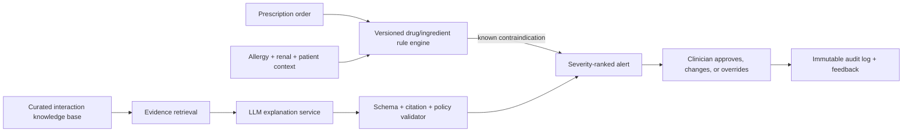

# Questions 6–7 — AI Integrity

## 6. Symptom to structured data

The input text is treated as **untrusted clinical narrative**, not a diagnosis. A strict prompt asks for extraction only:

```text
System: You are a clinical text extraction component. Extract only facts explicitly
stated by the user. Do not diagnose, infer, add a medicine, or give treatment advice.
Return valid JSON matching the supplied schema. Use null or [] for absent facts.

Schema:
{
  "symptoms": [{"name": "string", "duration_hours": "number|null"}],
  "negated_symptoms": ["string"],
  "medications_mentioned": ["string"],
  "source_language": "th",
  "needs_clinician_review": true
}

User text: {{verbatim_text}}
```

For the stated sentence, a conservative valid result is:

```json
{
  "symptoms": [{"name":"headache","duration_hours":2}],
  "negated_symptoms": [],
  "medications_mentioned": [],
  "source_language":"th",
  "needs_clinician_review":true
}
```

The server validates JSON against a schema, rejects extra fields, stores original text separately, and shows the extraction to a human for correction. Prompt injection is reduced by putting the user text in a delimited data field; it never changes system instructions. If the model emits medical advice, unsupported facts, invalid JSON, or low-confidence extraction, fail closed: return “unable to reliably extract; clinician review required.”

## 7. Smart Drug Interaction Checker

### Architecture



The **rule engine and curated knowledge base** make the safety decision. The LLM is optional and constrained to explaining retrieved, versioned evidence in plain language; it cannot invent an interaction, approve an order, or prescribe an alternative. All model traffic uses a minimum necessary, pseudonymised context and is governed by approved data-processing terms.

### Human-in-the-loop and safe failure

- High-severity alert blocks completion until a clinician reviews it; override captures reason, identity, timestamp, evidence version, and (where policy requires) a second sign-off.
- Display source, evidence date, confidence, and “not a substitute for clinical judgment”; avoid ungrounded confidence scores.
- If retrieval, model, or validation fails, the deterministic rule result remains visible and the system routes to pharmacist/clinician review. It never silently permits the order.
- Evaluate offline against clinician-labelled cases: sensitivity for severe interactions, false-alert burden, grounded-citation rate, JSON validity, latency, and override outcomes. Monitor drift after every knowledge-base/model change and retain a rollback version.
